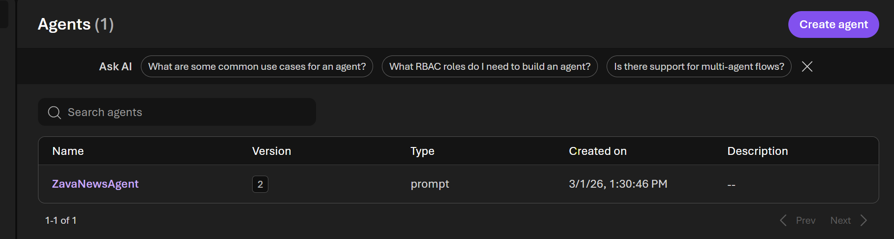
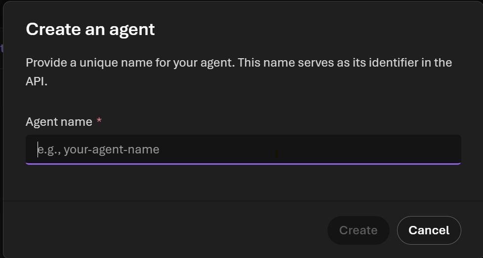
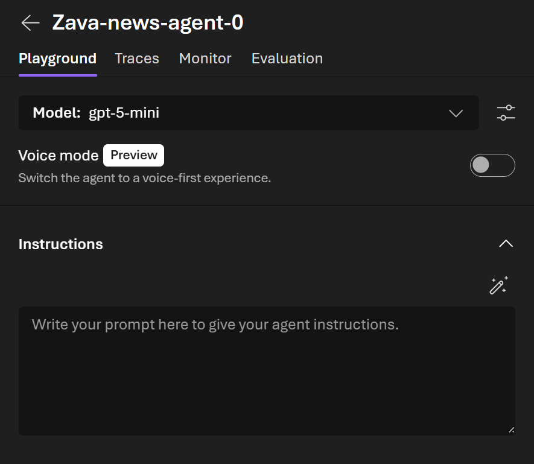
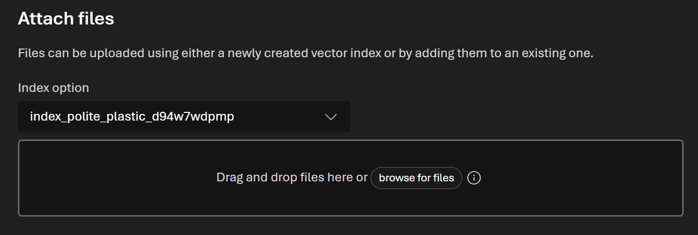
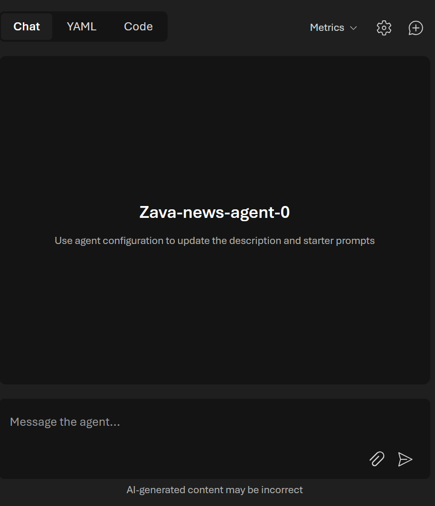

# Create a Foundry Agent

In this lab, you will create a **persistent Microsoft Foundry agent** that reads news and recommends inventory adjustments using Zava sales context.

## Objective

Build an agent that can:
- Analyze a news story or trend signal
- Infer potential demand changes
- Recommend inventory changes by SKU (increase/decrease + percentage)
- Explain the reasoning clearly

## Prerequisites

Before you start, make sure:
- You have access to your Foundry project
- A model is already deployed in that project
- You can access the workshop data files in `data/`

## What you should capture (deliverables)

At the end of the lab, save these values for Lab 2:
- **Project Endpoint**
- **Agent ID**

## Step 1: Create the agent shell

In the Foundry portal, open your project and click **Create Agent**.



## Step 2: Configure basic agent settings

1. Enter an agent name (suggested: `ProductInventoryManager`).
2. Optionally add a short description, such as:
   - `Analyzes market/news signals and recommends inventory changes for Zava products.`



## Step 3: Select model and instructions

1. Select the deployed model from your project.
2. Paste the following instructions into the agent instruction field.


```
You are an expert in supply chain planning for Zava products.

Given news articles, market events, and sales context, determine which SKUs should have inventory increased or decreased.

Return your answer as a markdown table with exactly these columns:

SKU | Product | Increase or Decrease | Percentage | Reason

Rules:
- Percentage must be a signed whole number (for example: +15%, -10%).
- Keep recommendations realistic (typically between -30% and +30% unless there is strong evidence).
- Include one concise reason per SKU that references the event signal.
- If no changes are justified, return one row with `No Change` and explain why.
```

## Step 4: Add knowledge/data sources

Attach or import relevant workshop files as knowledge, including:
- `data/Zava Products - Curated.txt`
- `data/Zava Sales Data - FY2024-2026.json`
- One or more news stories from `data/`

Then verify your knowledge attachment screen.



Use the additional panel to confirm the source files are attached and indexed for retrieval.



## Step 5: Test the agent

Open the test/chat panel and run a validation query.



Run a test prompt such as:

Use the East Region Ice Storm story and the Zava sales data. Recommend inventory adjustments by SKU for the next 30 days.

Confirm the response:
- Uses the required table format
- Includes actionable percentage adjustments
- Contains reasons tied to the provided evidence

## Step 6: Save identifiers for next labs

Record the following values in your notes:
- **Project Endpoint**
- **Agent ID**

You will use both in `labs/lab-run-foundry-agent/`.

## Quick troubleshooting

- **Model not visible:** Ensure deployment completed successfully in the same Foundry project.
- **Weak recommendations:** Tighten the instruction prompt and attach additional knowledge files.
- **Wrong output format:** Reiterate "markdown table with exact columns" in the system instructions.